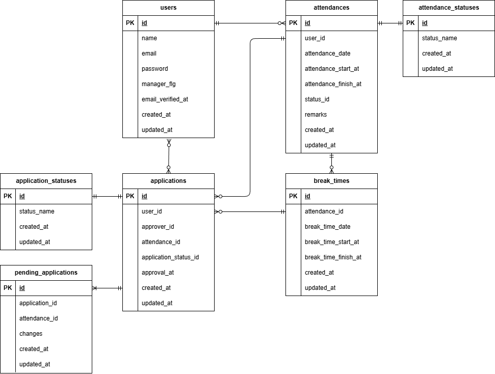

# Attendance Management

## Dockerビルド
- `git clone git@github.com:Nakama624/attendance_management.git`
- `cd attendance_management`
- `docker-compose up -d --build`

## Laravel環境構築
- `docker-compose exec php bash`
- `composer install`
- `cp .env.example .env`、環境変数を変更
- `php artisan key:generate`
- `php artisan migrate`
- `php artisan db:seed`

## mailhog環境設定
> `.env` ファイルを以下のように修正。
> ```diff
> -　MAIL_FROM_ADDRESS=null
> +　MAIL_FROM_ADDRESS=no-reply@example.com
>```

## テストアカウント
### 管理者
- メールアドレス`manager1@gmail.com`
- パスワード `password`
  ※管理者はmanager_flg=1
  
### 一般ユーザー
- メールアドレス`ippan1@gmail.com`
- パスワード `password`

## 単体テスト
### DBを作成
- `docker-compose exec mysql bash`
- `mysql -u root -p`、パスワード入力
- `CREATE DATABASE demo_test;`
- `exit`

### .env.testingを作成
- `docker-compose exec php bash`
- `cp .env .env.testing`、環境変数を変更
- `php artisan key:generate --env=testing`
- `php artisan migrate --env=testing`

## テスト実行
- 1.認証機能（一般ユーザー）：
  `vendor/bin/phpunit tests/Feature/RegisterTest.php`
- 2.ログイン認証機能（一般ユーザー）：
  `vendor/bin/phpunit tests/Feature/LoginTest.php`
- 3.ログイン認証機能（管理者）：
  `vendor/bin/phpunit tests/Feature/AdminLoginTest.php`
- 4.日時取得機能：
 `vendor/bin/phpunit tests/Feature/StampingTest.php`
- 5.ステータス確認機能：
 `vendor/bin/phpunit tests/Feature/AttendanceStatusTest.php`
- 6.出勤機能：
 `vendor/bin/phpunit tests/Feature/StampingStartWorkTest.php`
- 7.休憩機能：
 `vendor/bin/phpunit tests/Feature/StampingBreakTimeTest.php`
- 8.退勤機能：
 `vendor/bin/phpunit tests/Feature/StampingFinishWorkTest.php`
- 9.勤怠一覧情報取得機能（一般ユーザー）：
 `vendor/bin/phpunit tests/Feature/AttendanceListTest.php`
- 10.勤怠詳細情報取得機能（一般ユーザー）：
 `vendor/bin/phpunit tests/Feature/AttendanceDetailTest.php`
- 11.勤怠詳細情報修正機能（一般ユーザー）：
 `vendor/bin/phpunit tests/Feature/ModifyAttendanceDetailTest.php`
- 12.勤怠一覧情報取得機能（管理者）：
 `vendor/bin/phpunit tests/Feature/AdminAttendanceListTest.php`
- 13.勤怠詳細情報取得・修正機能（管理者）：
 `vendor/bin/phpunit tests/Feature/AdminAttendanceDetailModifyTest.php`
- 14.ユーザー情報取得機能（管理者）：
 `vendor/bin/phpunit tests/Feature/AdminAttendanceListEachUsersTest.php`
- 15.勤怠情報修正機能（管理者）：
 `vendor/bin/phpunit tests/Feature/AdminAttendanceModifyTest.php`
- 16.メール認証機能：
 `vendor/bin/phpunit tests/Feature/MailAuthTest.php`

## 使用技術（実行環境）
- PHP 8.1.34
- Laravel Framework 8.83.29
- mysql  Ver 8.0.26
- nginx/1.21.1

## ER図


## URL
- 新規登録：http://localhost/register
- phpMyAdmin：http://localhost:8080/

### 一般ユーザー
- ログイン：http://localhost/login
- 勤怠登録：http://localhost/attendance
- 勤怠一覧：http://localhost/attendance/list
- 申請一覧（承認待ち）：http://localhost/stamp_correction_request/list?page=pending


### 管理者
- 管理者ログイン：http://localhost/admin/login
- 勤怠一覧：http://localhost/admin/attendance/list
- スタッフ一覧：http://localhost/admin/staff/list
- 申請一覧（承認待ち）：http://localhost/stamp_correction_request/list?page=pending
